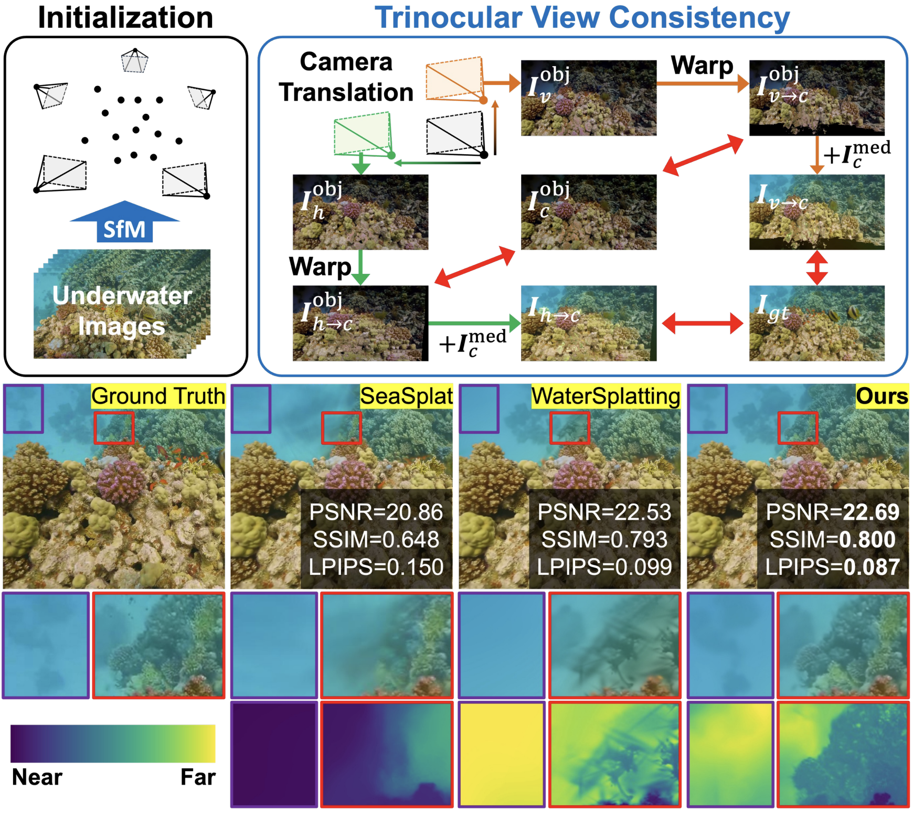

<h1 align="center">OceanSplat</h1>

  <b>O</b>bje<b>c</b>t-awar<b>e</b> Gaussi<b>an</b> <b>Splat</b>ting with Trinocular View Consistency for Underwater Scene Reconstruction 
  
    Minseong Kweon, Jinsun Park
  

   
  <em>  OceanSplat overcomes scattering and attenuation effects through trinocular view consistency, preserving object structure and enabling high-quality underwater 3D reconstruction.
</em>

  📄 <a href="https://arxiv.org/pdf/2601.04984">Paper</a>

